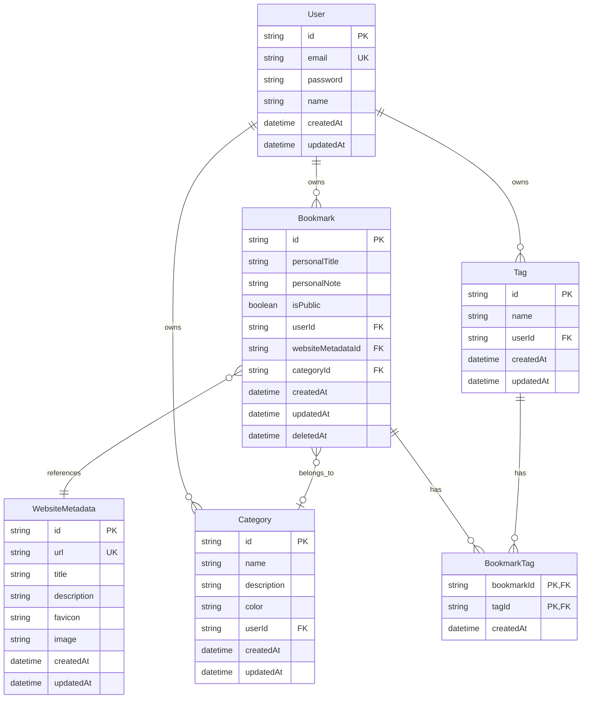
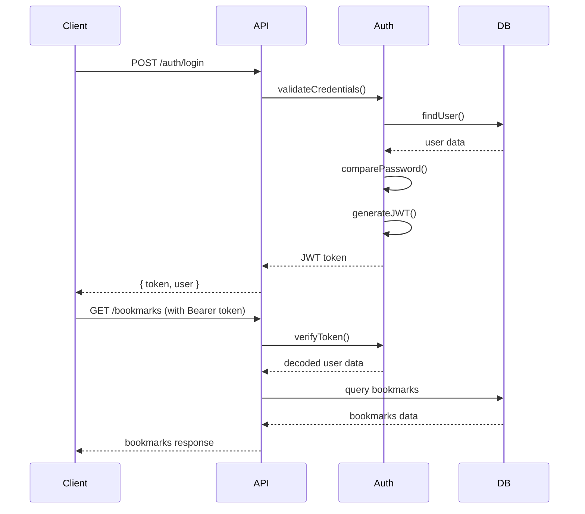

# 시스템 아키텍처 가이드

## 개요

이 문서는 북마크 관리 API의 시스템 아키텍처, 설계 원칙, 그리고 개선 방향을 설명합니다.

## 현재 아키텍처

### 기술 스택

```
┌─────────────────────────────────────────────────────────────┐
│                    Client Applications                      │
├─────────────────────────────────────────────────────────────┤
│                    HTTP/REST API                           │
├─────────────────────────────────────────────────────────────┤
│               Fastify Web Framework                        │
├─────────────────────────────────────────────────────────────┤
│         TypeScript Application Layer                       │
├─────────────────────────────────────────────────────────────┤
│                 Prisma ORM                                │
├─────────────────────────────────────────────────────────────┤
│                PostgreSQL Database                         │
└─────────────────────────────────────────────────────────────┘
```

### 프로젝트 구조

```
src/
├── app.ts              # Fastify 애플리케이션 설정
├── index.ts            # 애플리케이션 진입점
├── config/
│   ├── database.ts     # 데이터베이스 연결 설정
│   └── env.ts          # 환경 변수 검증
├── middleware/
│   └── auth.ts         # JWT 인증 미들웨어
├── routes/
│   ├── auth.ts         # 인증 관련 라우트
│   ├── bookmarks.ts    # 북마크 관련 라우트
│   ├── categories.ts   # 카테고리 관련 라우트
│   └── tags.ts         # 태그 관련 라우트
└── utils/
    ├── auth.ts         # 인증 유틸리티
    └── response.ts     # 응답 포맷팅 유틸리티
```

## 현재 아키텍처의 특징

### ✅ 장점

1. **단순성**: 직관적이고 이해하기 쉬운 구조
2. **빠른 개발**: 프로토타입 및 MVP 개발에 적합
3. **타입 안정성**: TypeScript로 타입 안정성 보장
4. **현대적 스택**: Fastify, Prisma 등 최신 기술 스택 활용

### ⚠️ 현재 문제점

#### 1. 레이어 분리 부족

**문제**: 라우트 파일에 비즈니스 로직이 직접 구현됨

```typescript
// 현재 방식 (routes/bookmarks.ts)
app.get('/bookmarks', async (request, reply) => {
  // 인증 로직
  const token = request.headers.authorization?.replace('Bearer ', '');
  const decoded = jwt.verify(token, env.JWT_SECRET);
  
  // 비즈니스 로직
  const bookmarks = await prisma.bookmark.findMany({
    where: { userId: decoded.userId },
    include: { category: true, tags: true }
  });
  
  // 응답 처리
  return success(bookmarks);
});
```

**문제점**:
- 코드 재사용성 저하
- 테스트 어려움
- 관심사 분리 원칙 위반

#### 2. 중복 코드

**문제**: 각 라우트에서 인증, 검증, 에러 처리 로직 중복

```typescript
// 여러 파일에서 반복되는 패턴
const authenticate = async (request: FastifyRequest) => {
  const token = request.headers.authorization?.replace('Bearer ', '');
  if (!token) throw new Error('토큰이 없습니다');
  return jwt.verify(token, env.JWT_SECRET);
};
```

#### 3. 스키마 정의 분산

**문제**: Zod 스키마가 각 라우트 파일에 개별 정의됨

```typescript
// routes/bookmarks.ts
const createBookmarkSchema = z.object({
  url: z.string().url(),
  personalTitle: z.string().optional()
});

// routes/categories.ts
const createCategorySchema = z.object({
  name: z.string().min(1),
  description: z.string().optional()
});
```

## 개선된 아키텍처 제안

### 권장 레이어 구조

```
┌─────────────────────────────────────────────────────────────┐
│                    Routes Layer                            │
│              (HTTP 요청/응답 처리)                           │
├─────────────────────────────────────────────────────────────┤
│                 Controllers Layer                          │
│            (요청 검증, 응답 포맷팅)                           │
├─────────────────────────────────────────────────────────────┤
│                 Services Layer                             │
│              (비즈니스 로직 구현)                             │
├─────────────────────────────────────────────────────────────┤
│                Repository Layer                            │
│              (데이터 접근 로직)                              │
├─────────────────────────────────────────────────────────────┤
│                  Database Layer                            │
│                (Prisma + PostgreSQL)                       │
└─────────────────────────────────────────────────────────────┘
```

### 개선된 프로젝트 구조

```
src/
├── app.ts
├── index.ts
├── config/
│   ├── database.ts
│   └── env.ts
├── controllers/        # 새로 추가
│   ├── AuthController.ts
│   ├── BookmarkController.ts
│   ├── CategoryController.ts
│   └── TagController.ts
├── services/           # 새로 추가
│   ├── AuthService.ts
│   ├── BookmarkService.ts
│   ├── CategoryService.ts
│   └── TagService.ts
├── repositories/       # 새로 추가 (선택사항)
│   ├── BookmarkRepository.ts
│   └── UserRepository.ts
├── schemas/            # 새로 추가
│   ├── auth.schemas.ts
│   ├── bookmark.schemas.ts
│   ├── category.schemas.ts
│   └── tag.schemas.ts
├── middleware/
│   ├── auth.ts
│   ├── validation.ts   # 새로 추가
│   └── errorHandler.ts # 새로 추가
├── routes/
│   ├── auth.ts
│   ├── bookmarks.ts
│   ├── categories.ts
│   └── tags.ts
├── types/              # 새로 추가
│   ├── auth.types.ts
│   └── common.types.ts
└── utils/
    ├── auth.ts
    ├── response.ts
    └── validation.ts
```

### 레이어별 책임

#### 1. Routes Layer (라우트 계층)

```typescript
// routes/bookmarks.ts
export default async function bookmarkRoutes(app: FastifyInstance) {
  app.register(async function (app) {
    app.addHook('preHandler', requireAuth);
    
    app.get('/', bookmarkController.getBookmarks);
    app.post('/', {
      schema: { body: createBookmarkSchema }
    }, bookmarkController.createBookmark);
  });
}
```

**책임**:
- HTTP 엔드포인트 정의
- 미들웨어 등록
- 스키마 검증 설정
- 컨트롤러 메서드 연결

#### 2. Controllers Layer (컨트롤러 계층)

```typescript
// controllers/BookmarkController.ts
export class BookmarkController {
  constructor(private bookmarkService: BookmarkService) {}

  async getBookmarks(request: FastifyRequest, reply: FastifyReply) {
    try {
      const userId = request.user.id;
      const query = request.query as BookmarkQuery;
      
      const result = await this.bookmarkService.getBookmarks(userId, query);
      
      return reply.send(success(result));
    } catch (error) {
      return reply.status(500).send(errorResponse(error));
    }
  }

  async createBookmark(request: FastifyRequest, reply: FastifyReply) {
    const userId = request.user.id;
    const data = request.body as CreateBookmarkRequest;
    
    const bookmark = await this.bookmarkService.createBookmark(userId, data);
    
    return reply.status(201).send(success(bookmark));
  }
}
```

**책임**:
- HTTP 요청/응답 처리
- 요청 데이터 추출 및 검증
- 서비스 레이어 호출
- 응답 포맷팅
- 에러 처리

#### 3. Services Layer (서비스 계층)

```typescript
// services/BookmarkService.ts
export class BookmarkService {
  constructor(
    private bookmarkRepository: BookmarkRepository,
    private metadataService: MetadataService
  ) {}

  async createBookmark(userId: string, data: CreateBookmarkData): Promise<Bookmark> {
    // 비즈니스 로직 구현
    
    // 1. URL 메타데이터 추출 또는 캐시에서 조회
    const metadata = await this.metadataService.getOrFetchMetadata(data.url);
    
    // 2. 중복 북마크 확인
    const existing = await this.bookmarkRepository.findByUserAndUrl(userId, data.url);
    if (existing) {
      throw new Error('이미 저장된 북마크입니다');
    }
    
    // 3. 북마크 생성
    return await this.bookmarkRepository.create({
      ...data,
      userId,
      websiteMetadataId: metadata.id
    });
  }

  async getBookmarks(userId: string, query: BookmarkQuery): Promise<BookmarkListResult> {
    // 필터링 및 정렬 로직
    const filters = this.buildFilters(userId, query);
    const pagination = this.buildPagination(query);
    
    const bookmarks = await this.bookmarkRepository.findMany(filters, pagination);
    const total = await this.bookmarkRepository.count(filters);
    
    return {
      bookmarks,
      pagination: {
        ...pagination,
        total,
        totalPages: Math.ceil(total / pagination.limit)
      }
    };
  }

  private buildFilters(userId: string, query: BookmarkQuery) {
    // 필터 구성 로직
  }
}
```

**책임**:
- 핵심 비즈니스 로직 구현
- 도메인 규칙 적용
- 다른 서비스와의 조합
- 트랜잭션 관리
- 복잡한 쿼리 로직

#### 4. Repository Layer (저장소 계층) - 선택사항

```typescript
// repositories/BookmarkRepository.ts
export class BookmarkRepository {
  constructor(private prisma: PrismaClient) {}

  async create(data: CreateBookmarkData): Promise<Bookmark> {
    return await this.prisma.bookmark.create({
      data,
      include: {
        websiteMetadata: true,
        category: true,
        tags: { include: { tag: true } }
      }
    });
  }

  async findByUserAndUrl(userId: string, url: string): Promise<Bookmark | null> {
    return await this.prisma.bookmark.findFirst({
      where: {
        userId,
        websiteMetadata: { url },
        deletedAt: null
      }
    });
  }

  async findMany(filters: BookmarkFilters, pagination: Pagination): Promise<Bookmark[]> {
    return await this.prisma.bookmark.findMany({
      where: filters,
      skip: (pagination.page - 1) * pagination.limit,
      take: pagination.limit,
      orderBy: { createdAt: 'desc' },
      include: {
        websiteMetadata: true,
        category: true,
        tags: { include: { tag: true } }
      }
    });
  }
}
```

**책임**:
- 데이터베이스 접근 로직
- 복잡한 쿼리 구현
- 데이터 변환
- 캐싱 로직

### 의존성 주입 및 컨테이너

```typescript
// config/container.ts
export class Container {
  private static instance: Container;
  private services = new Map();

  static getInstance(): Container {
    if (!Container.instance) {
      Container.instance = new Container();
    }
    return Container.instance;
  }

  register<T>(key: string, factory: () => T): void {
    this.services.set(key, factory);
  }

  resolve<T>(key: string): T {
    const factory = this.services.get(key);
    if (!factory) {
      throw new Error(`Service ${key} not found`);
    }
    return factory();
  }
}

// 서비스 등록
const container = Container.getInstance();
container.register('bookmarkService', () => new BookmarkService(
  container.resolve('bookmarkRepository'),
  container.resolve('metadataService')
));
```

## 데이터베이스 설계 원칙

### 현재 스키마 구조



### 설계 원칙

1. **정규화**: 3NF까지 정규화하여 데이터 중복 최소화
2. **소프트 삭제**: 중요 데이터는 `deletedAt` 컬럼으로 소프트 삭제
3. **사용자 격리**: 모든 주요 엔티티에 `userId` 포함으로 사용자별 데이터 격리
4. **메타데이터 캐싱**: `WebsiteMetadata`로 동일 URL의 메타데이터 중복 저장 방지
5. **유니크 제약**: 사용자별 카테고리명, 태그명 유니크 제약

### 인덱스 전략

```sql
-- 사용자별 북마크 조회 최적화
CREATE INDEX idx_bookmarks_user_deleted ON bookmarks(userId, deletedAt);

-- 카테고리별 북마크 조회 최적화
CREATE INDEX idx_bookmarks_category ON bookmarks(categoryId);

-- 생성일자 정렬 최적화
CREATE INDEX idx_bookmarks_created ON bookmarks(createdAt);

-- 사용자별 카테고리 유니크 제약
CREATE UNIQUE INDEX idx_categories_user_name ON categories(userId, name);

-- 사용자별 태그 유니크 제약
CREATE UNIQUE INDEX idx_tags_user_name ON tags(userId, name);

-- URL 메타데이터 중복 방지
CREATE UNIQUE INDEX idx_metadata_url ON website_metadata(url);
```

## 보안 아키텍처

### 인증 흐름



### 보안 레이어

1. **Transport Security**: HTTPS 강제
2. **Authentication**: JWT 토큰 기반 인증
3. **Authorization**: 사용자별 데이터 접근 제어
4. **Input Validation**: Zod 스키마 검증
5. **SQL Injection 방지**: Prisma ORM 사용
6. **Rate Limiting**: 요청 빈도 제한
7. **CORS**: Cross-Origin 요청 제어
8. **Security Headers**: Helmet 미들웨어

## 성능 고려사항

### 현재 최적화

1. **데이터베이스 인덱스**: 주요 쿼리 패턴에 인덱스 적용
2. **페이지네이션**: 대용량 데이터 처리를 위한 페이지네이션
3. **관계형 쿼리 최적화**: Prisma include를 활용한 N+1 문제 방지
4. **메타데이터 캐싱**: 동일 URL 메타데이터 재사용

### 향후 최적화 계획

1. **Redis 캐싱**: 자주 조회되는 데이터 캐싱
2. **Connection Pooling**: 데이터베이스 연결 풀 최적화
3. **Query 최적화**: 복잡한 쿼리 성능 튜닝
4. **CDN**: 정적 자산 배포 최적화

## 확장성 고려사항

### 수평 확장 준비

1. **Stateless 설계**: JWT 토큰으로 세션 상태 제거
2. **Database 분리**: 읽기/쓰기 분리 가능한 구조
3. **Microservice 준비**: 도메인별 서비스 분리 가능
4. **API Gateway 연동**: 외부 API Gateway와 연동 가능

### 모니터링 및 로깅

```typescript
// 구조화된 로깅
import { logger } from './config/logger';

export class BookmarkService {
  async createBookmark(userId: string, data: CreateBookmarkData) {
    logger.info('북마크 생성 시작', {
      userId,
      url: data.url,
      timestamp: new Date().toISOString()
    });

    try {
      const result = await this.doCreateBookmark(userId, data);
      
      logger.info('북마크 생성 완료', {
        userId,
        bookmarkId: result.id,
        duration: Date.now() - startTime
      });
      
      return result;
    } catch (error) {
      logger.error('북마크 생성 실패', {
        userId,
        error: error.message,
        stack: error.stack
      });
      throw error;
    }
  }
}
```

## 마이그레이션 계획

### 단계별 리팩토링

#### Phase 1: 기본 레이어 분리
- [ ] Controller 레이어 도입
- [ ] Service 레이어 구현
- [ ] 스키마 중앙화

#### Phase 2: 의존성 관리
- [ ] 의존성 주입 컨테이너 도입
- [ ] 인터페이스 정의
- [ ] 테스트 개선

#### Phase 3: 고급 기능
- [ ] Repository 레이어 추가
- [ ] 캐싱 레이어 도입
- [ ] 모니터링 강화

### 마이그레이션 전략

1. **점진적 변경**: 기존 코드를 단계적으로 리팩토링
2. **테스트 유지**: 기존 테스트를 유지하면서 새로운 테스트 추가
3. **백워드 호환성**: API 인터페이스 변경 최소화
4. **문서화**: 변경사항을 문서로 기록

이 아키텍처 가이드는 프로젝트의 성장과 함께 지속적으로 업데이트될 예정입니다.